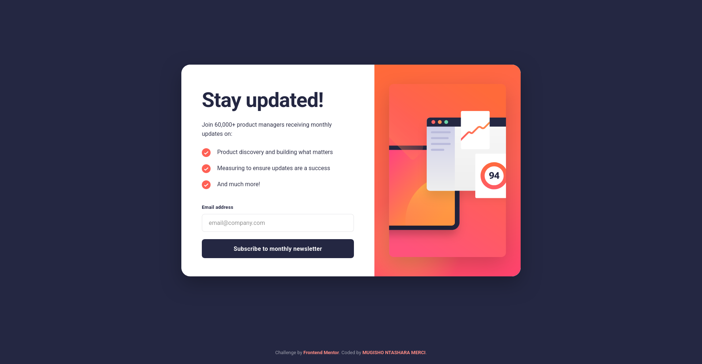
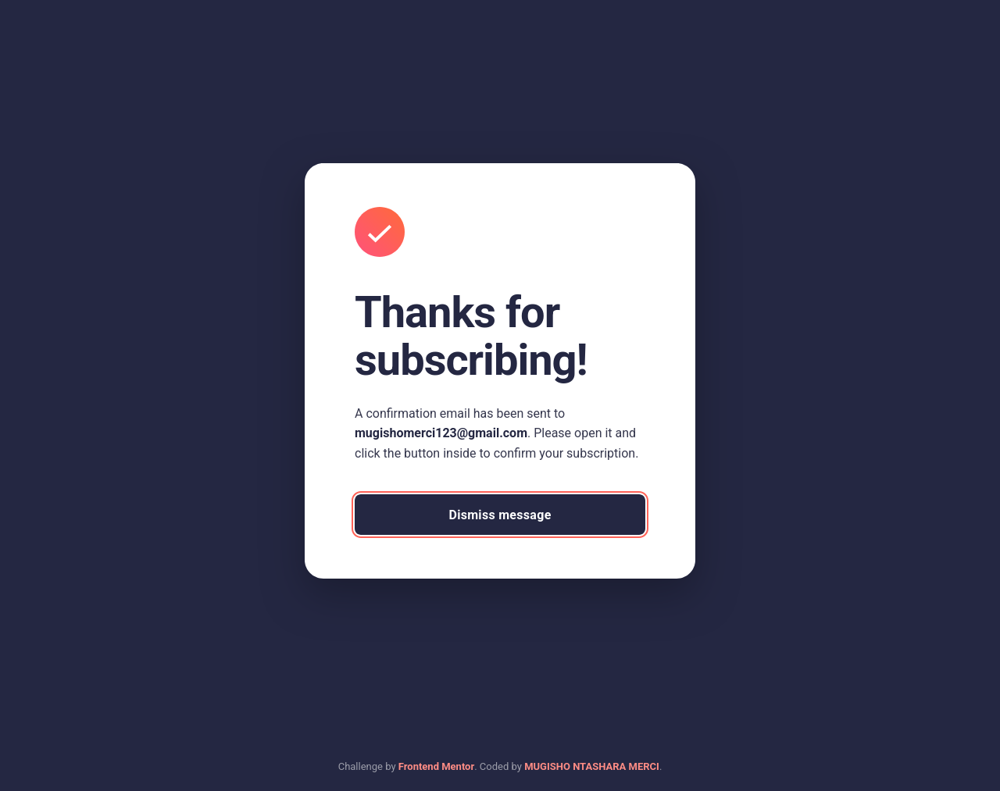

# Frontend Mentor - Newsletter sign-up form with success message solution

This is a solution to the [Newsletter sign-up form with success message challenge on Frontend Mentor](https://www.frontendmentor.io/challenges/newsletter-signup-form-with-success-message-3FC1AZbNrv). Frontend Mentor challenges help you improve your coding skills by building realistic projects.

## Table of contents

- [Overview](#overview)
  - [The challenge](#the-challenge)
  - [Screenshot](#screenshot)
  - [Links](#links)
- [My process](#my-process)
  - [Built with](#built-with)
  - [What I learned](#what-i-learned)
  - [Continued development](#continued-development)
  - [Useful resources](#useful-resources)
- [Author](#author)
- [Acknowledgments](#acknowledgments)

## Overview

### The challenge

Users should be able to:

- Add their email and submit the form
- See a success message with their email after successfully submitting the form
- See form validation messages if:
  - The field is left empty
  - The email address is not formatted correctly
- View the optimal layout for the interface depending on their device's screen size
- See hover and focus states for all interactive elements on the page

### Screenshot





### Links

- Solution URL: https://github.com/Mugisho-dev-metasploit/Frontend-Mentor---Newsletter-sign-up-form-with-success-message-solution-challenge-03
- Live Site URL: https://mugisho-dev-metasploit.github.io/Frontend-Mentor---Newsletter-sign-up-form-with-success-message-solution-challenge-03/

## My process

### Built with

- HTML5
- CSS custom properties
- Flexbox
- CSS Grid
- Mobile-first workflow
- Vanilla JavaScript (form validation + success message)
- Responsive design

### What I learned

In this project I reinforced how to build a form that feels polished and accessible:

#### 1. Semantic HTML for Forms

Building proper form structure with semantic elements ensures better accessibility and browser support:

```html
<form id="newsletterForm" novalidate>
  <label for="emailInput">Email address</label>
  <input 
    type="email" 
    id="emailInput" 
    name="email" 
    placeholder="example@outlook.com"
    required
  />
  <button type="submit">Subscribe to monthly newsletter</button>
</form>
```

**Why it matters:** Using `<label>` with `for` attribute connects labels to inputs, improving keyboard navigation and screen reader compatibility.

#### 2. Form Validation with Constraint Validation API

Instead of custom validation logic, I leveraged the browser's built-in Constraint Validation API:

```javascript
const form = document.getElementById('newsletterForm');
const emailInput = document.getElementById('emailInput');

form.addEventListener('submit', (e) => {
  e.preventDefault();
  
  // Check browser validation first
  if (!form.checkValidity()) {
    emailInput.classList.add('invalid');
    emailInput.setAttribute('aria-invalid', 'true');
    return;
  }
  
  // Valid email - proceed with success message
  showSuccessMessage(emailInput.value);
  form.reset();
});

emailInput.addEventListener('input', () => {
  emailInput.classList.remove('invalid');
  emailInput.setAttribute('aria-invalid', 'false');
});
```

**Key benefits:** Native browser validation handles email format checking, required field validation, and provides multilingual error messages without extra code.

#### 3. Dynamic UI State Management

Toggling visibility between form and success message using CSS classes:

```javascript
function showSuccessMessage(email) {
  document.getElementById('formContainer').classList.add('hidden');
  document.getElementById('successContainer').classList.remove('hidden');
  document.getElementById('userEmail').textContent = email;
}

function dismissMessage() {
  document.getElementById('formContainer').classList.remove('hidden');
  document.getElementById('successContainer').classList.add('hidden');
}
```

```css
.hidden {
  display: none;
}

.invalid {
  border-color: #ff6155;
  background-color: rgba(255, 97, 85, 0.1);
}

.invalid::placeholder {
  color: #ff6155;
}
```

#### 4. Responsive Layout with Flexbox & Grid

Desktop layout uses CSS Grid for two-column design:

```css
@media (min-width: 1024px) {
  .container {
    display: grid;
    grid-template-columns: 1fr 1fr;
    gap: 40px;
    align-items: center;
  }
  
  .form-section {
    max-width: 400px;
  }
  
  .image-section {
    display: flex;
    justify-content: flex-end;
  }
}
```

Mobile-first approach ensures single-column layout on smaller screens, progressively enhanced for larger viewports.

### Continued development

Things I want to explore next on this project:

- Improve accessibility by adding aria-live announcements for the success message
- Add subtle animations between the form and the success state
- Persist the email address using localStorage so the form remembers the last entry

### Useful resources

- [MDN Web Docs - Form validation](https://developer.mozilla.org/en-US/docs/Learn/Forms/Form_validation)
- [Frontend Mentor community](https://www.frontendmentor.io/community)
- [CSS-Tricks - A Complete Guide to Flexbox](https://css-tricks.com/snippets/css/a-guide-to-flexbox/)

## Author

- Name: MUGISHO NTAHARA
- Frontend Mentor: [@Mugisho-dev-metasploit](https://www.frontendmentor.io/profile/Mugisho-dev-metasploit)
- GitHub: [Mugisho-dev-metasploit](https://github.com/Mugisho-dev-metasploit)
- Upwork: [MUGISHO NTAHARA](https://www.upwork.com/freelancers/~01a2f97f4e3bb50a4c?companyReference=1864191587205410991&mp_source=share)

## Acknowledgments

Thanks to Frontend Mentor for the challenge and to the community for inspiration and support.
 